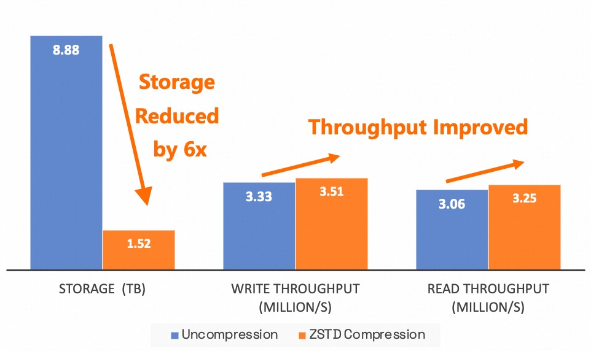
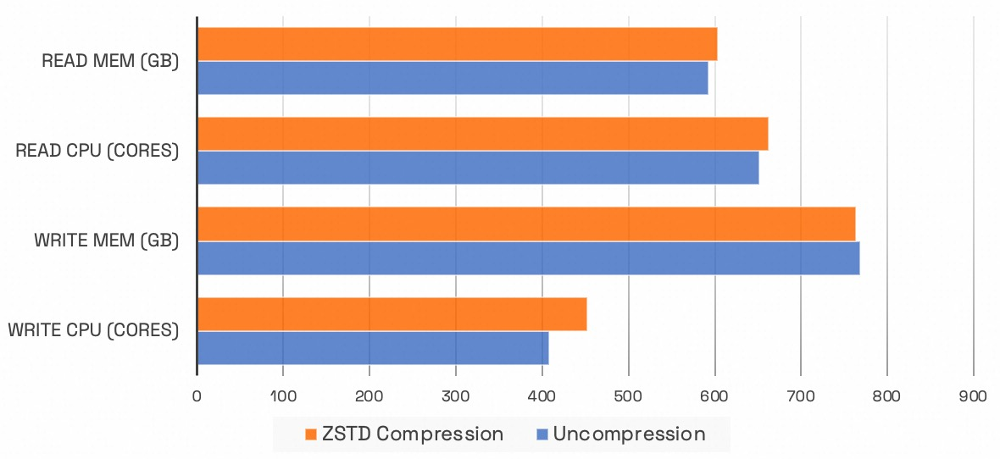
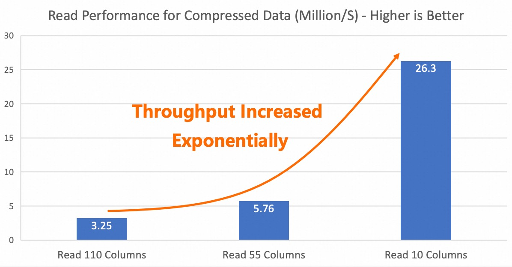
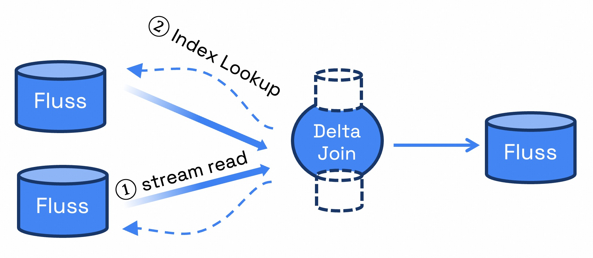

<!--
 Copyright (c) 2025 Alibaba Group Holding Ltd.

 Licensed under the Apache License, Version 2.0 (the "License");
 you may not use this file except in compliance with the License.
 You may obtain a copy of the License at

      http://www.apache.org/licenses/LICENSE-2.0

 Unless required by applicable law or agreed to in writing, software
 distributed under the License is distributed on an "AS IS" BASIS,
 WITHOUT WARRANTIES OR CONDITIONS OF ANY KIND, either express or implied.
 See the License for the specific language governing permissions and
 limitations under the License.
-->

The Fluss community is pleased to announce the official release of **Fluss 0.6.0**. This version has undergone over
three months of intensive development, bringing together the expertise and efforts of 45 contributors worldwide,
with more than 200 code commits completed. Our heartfelt thanks go out to every contributor for their invaluable support!


<!-- truncate -->

This release introduces several exciting features:

- **Column Compression**: Reduces storage space by up to **6x** while preserving column pruning performance!
- **Merge Engine**: Introduces flexible merge strategies for primary key data, addressing diverse real-time processing needs.
- **Prefix Lookup**: Delta Join functionality is now ready on the Fluss side!

These new features not only significantly enhance the functionality of Fluss but also represent a solid step
forward in our journey toward building the next-generation analytical stream storage solution.

## Column Compression

Fluss uses the [Apache Arrow](https://arrow.apache.org/) columnar format for it's underlying log file storage, fully leveraging Arrow's streaming
columnar capabilities to achieve highly efficient streaming reads and column pruning. Column pruning in Fluss is performed on the server side,
with end-to-end zero-copy optimization that allows the required column data to be sent directly to the network without
loading it into memory from disk. This design not only significantly improves performance but also drastically reduces
network I/O costs and resource overhead. In previous [benchmark tests](../2024-12-12-fluss-intro.md#columnar-stream),
when 90% of the columns were pruned, Fluss achieved a 10x increase in read throughput, demonstrating its exceptional
performance in streaming data processing and transmission.

While column pruning effectively reduces network I/O costs, disk storage costs remain high. To address this,
we have introduced **column compression** in this version, supporting two highly efficient compression algorithms: **ZSTD** and **LZ4**.
These algorithms significantly reduce data storage requirements, thereby lowering storage costs substantially.
Since both compression and decompression are performed on the client side, the amount of data transmitted over the network is reduced,
further decreasing network I/O costs. Notably, compression is applied independently to each column, ensuring that the original column pruning performance is preserved and that streaming read efficiency remains unaffected.

To validate the actual effectiveness of this feature, we conducted benchmark tests using a typical business scenario from Alibaba Taobao.
In the tests, we used datasets of the same scale and Flink jobs with identical resources, writing to Fluss with and without ZSTD compression,
and compared the write throughput. Subsequently, we read data from the table and tested the read throughput.
The results showed that column compression not only reduced storage space by approximately 6x but also improved read and write throughput.



However, enabling compression had no noticeable impact on Flink's read/write CPU and memory usage.



The performance of column pruning on compressed data was also tested. The results show that as the number of pruned columns increases,
a multiple-fold performance improvement is still achieved, maintaining the original column pruning efficiency.



Given the significant cost savings and performance improvements achieved by column compression in general use cases,
ZSTD compression is enabled by default for log tables in Fluss 0.6. Users can disable compression by
setting the parameter `'table.log.arrow.compression.type'='NONE'` on the table.

## Merge Engine

In this version, Fluss introduces a new Merge Engine feature for primary key tables to flexibly support merging strategies for data with the same primary key.
The default Merge Engine strategy for primary key tables is to retain the latest record for each primary key.
Users can also choose alternative Merge Engines, including the currently supported **FirstRow Merge Engine** and **Versioned Merge Engine**.
Support for the **Aggregate Merge Engine** is planned for future releases.

### FirstRow Merge Engine

By setting the table property `'table.merge-engine' = 'first_row'`, users can retain the first record for each primary key.
When this configuration is enabled, the primary key table will generate an append-only changelog. This allows downstream
Flink jobs subscribing to the table to receive an append-only stream, enabling the use of operators that do not support retraction messages,
such as Window Aggregations and Interval Joins. This feature is commonly used as a replacement for log deduplication in streaming processing,
effectively reducing costs and system complexity.

```sql
-- create first_row primary key table
CREATE TABLE T (
    k  INT,
    v1 DOUBLE,
    v2 STRING,
    PRIMARY KEY (k) NOT ENFORCED
) WITH (
    'table.merge-engine' = 'first_row'
);

INSERT INTO T VALUES (1, 2.0, 't1');
INSERT INTO T VALUES (1, 3.0, 't2');

SELECT * FROM T WHERE k = 1;

-- Output
-- +---+-----+------+
-- | k | v1  | v2   |
-- +---+-----+------+
-- | 1 | 2.0 | t1   |
-- +---+-----+------+
```

### Versioned Merge Engine

The Versioned Merge Engine supports data updates based on version numbers (or event timestamps). It ensures that only the record
with the highest version number (or event timestamp) for each primary key is retained. This mechanism is particularly useful for
deduplicating or merging out-of-order data while guaranteeing eventual consistency with the upstream data source.
In Flink streaming processing, this feature can be used as a replacement for `Rank` or `Deduplication` operations, simplifying workflows and reducing costs effectively.

```sql
-- create a versioned primary key table, `ts` as the version column
CREATE TABLE VERSIONED (
    a INT NOT NULL PRIMARY KEY NOT ENFORCED,
    b STRING,
    ts BIGINT
 ) WITH (
    'table.merge-engine' = 'versioned',
    'table.merge-engine.versioned.ver-column' = 'ts'
);
INSERT INTO VERSIONED (a, b, ts) VALUES (1, 'v1', 1000);

-- insert a record with ts < 1000, ignored
INSERT INTO VERSIONED (a, b, ts) VALUES (1, 'v2', 999);
SELECT * FROM VERSIONED WHERE a = 1;
-- Output
-- +---+-----+------+
-- | a | b   | ts   |
-- +---+-----+------+
-- | 1 | v1  | 1000 |
-- +---+-----+------+


-- insert a record with ts > 1000, updated
INSERT INTO VERSIONED (a, b, ts) VALUES (1, 'v3', 2000);
SELECT * FROM VERSIONED WHERE a = 1;
-- Output
-- +---+-----+------+
-- | a | b   | ts   |
-- +---+-----+------+
-- | 1 | v3  | 2000 |
-- +---+-----+------+
```

## Prefix Lookup for Delta Join

In the scenario of building wide tables with Flink, optimizing Stream-Stream Join using Delta Join is one of the primary use cases for Fluss.
We have also contributed this functionality to version 0.6. Delta Join can be simply understood as a "bilateral driven lookup join", that is:
when data arrives from the left stream, the right table is queried using the join key; when data arrives from the right stream, the left table is queried using the join key.
This approach eliminates join state like Lookup Join, while preserving the semantics of a Stream-Stream Join (any updates on either side triggers an update to the join result).
Delta Join addresses challenges such as high cost, unstable job, checkpoint timeout, slow restart recovery, etc., in the traditional Stream-Stream Join.



Overall, Delta Join relies on three core functionalities:
- **CDC Stream Read for Source Table**: The foundational capability of Fluss.
- **Lookup on Join Keys for Source Table**: Introduced in Fluss 0.6 with Prefix Lookup support.
- **Delta Join Operator in Flink SQL**: Proposed in [FLIP-486](https://cwiki.apache.org/confluence/display/FLINK/FLIP-486%3A+Introduce+A+New+DeltaJoin), planned for Flink 2.1.

Once FLIP-486 is completed, users will be able to achieve Delta Join using the following SQL in conjunction with Fluss's Prefix Lookup functionality:

```sql
CREATE TABLE fluss_left_table (
  a1 BIGINT,
  b1 BIGINT,
  c1 INT,
  d1 INT,
  PRIMARY KEY (c1,d1,a1) NOT ENFORCED  -- bucket key as a prefix of primary key
) WITH (
  'bucket.key' = 'c1,d1' -- define bucket key
);

CREATE TABLE fluss_right_table (
  a2 BIGINT,
  b2 BIGINT,
  c2 INT,
  d2 INT,
  PRIMARY KEY (c2,d2,a2) NOT ENFORCED  -- bucket key as a prefix of primary key
) WITH (
  'bucket.key' = 'c2,d2' -- define bucket key
);

-- it will be optimized to delta join, where the join key is the bucket key of the two tables
SELECT * FROM fluss_left_table INNER JOIN fluss_right_table
  ON c1 = c2 AND d1 = d2
```

Flink performs lookups on Fluss tables using the Join Key, which serves as the Bucket Key for the Fluss table.
This allows it to leverage the prefix index of the primary key in the Fluss table, enabling highly efficient lookup queries.
This feature in Fluss is referred to as Prefix Lookup. Currently, Prefix Lookup can also be used to perform one-to-many lookup queries.
For more details, please refer to the [Prefix Lookup](/docs/engine-flink/lookups/#prefix-lookup) documentation.

## Stability & Performance Improvements

In this version, we have focused on enhancing the stability and performance of the system, resolving over 50 issues and improvements,
and conducting in-depth optimizations on core modules. For example:

- Server-side Optimization : By introducing a delayed response mechanism, CPU consumption in low-traffic scenarios has been significantly reduced, thereby improving resource utilization efficiency.
- Client-side Optimization : A unified memory management mechanism has been implemented to effectively prevent Out-of-Memory (OOM) issues in high-traffic scenarios while reducing the impact of garbage collection (GC) on system performance.

These improvements have significantly enhanced Fluss's reliability and performance in high-concurrency, large-data-volume scenarios, enabling it to handle analytical stream storage workload more efficiently.

## Lakehouse Storage

In previous versions, if a table in Fluss needed to enable the Lakehouse storage capability, it had to be enabled when table is created.
Otherwise, enabling this feature later would require deleting and recreating the table. This limitation arose because enabling Lakehouse storage changes the key encoding format and bucket sharding strategy, making existing tables incompatible with the new configuration.

In this version, we resolve this by detecting the cluster's default data lake format and adopting its key encoding and bucketing strategy,
allowing Lakehouse storage to be enabled dynamically after table creation. This eliminates the need for table recreation, improving usability.
Additionally, Paimon dependency is upgraded to version 1.0.1 in this release.

## Flink Integration

This version introduces the following enhancements to the Flink connector:

1. **Sink Support for Ignoring Retractions:**
  Both Primary Key Tables and Log Tables now support the `'sink.ignore-delete'` parameter in their Sink implementations. This enables better compatibility with scenarios involving retraction messages, meeting the demands of more complex streaming data processing.
2. **Enhanced Partition Table Operations:**
  Partitioned tables now support `ALTER TABLE ADD/DROP PARTITION` and `SHOW PARTITIONS` operations, further improving the flexibility and usability of partition management.
3. **Sink Interface Upgrade:**
  The `SinkFunction` has been upgraded to the `SinkV2` interface, laying the groundwork for full compatibility with Flink 2.0 in the next version. This ensures the system's scalability and compatibility in future releases.

## Upgrade Notes
The Fluss community try to ensure compatibility during upgrades. However, upgrading from Fluss 0.5 to 0.6 is an incompatible upgrade.
Starting with version 0.6, we will officially provide backward compatibility to ensure smoother and more reliable upgrades in future releases.
Therefore, version 0.6 is the recommended version for adoption and ecosystem integration.


## Future Plan

In the next version, we will focus on the development of the following core features:

1. **New Lake-Stream Integrated Architecture:**
   A completely new architecture designed for large-scale production environments, featuring plug-in support for mainstream lake formats such as Iceberg and Hudi. This addresses key pain points in Tiering Service performance, scalability, and operational efficiency, providing a more reliable Lakehouse integrated solution for enterprise use cases.

2. **Authentication and Authorization:**
   Introducing plugin-based authentication and fine-grained access control to meet the stringent data security requirements of enterprises.

3. **Kafka Compatibility:**
   Compatibility with the Kafka network protocol, enabling seamless integration with the Kafka ecosystem.

For more details about the next release roadmap, please visit the community [discussion page](https://github.com/alibaba/fluss/discussions/556). Your suggestions and contributions are highly welcomed!

Fluss is under active development. Be sure to stay updated on the project, give it a try and if you like it, don’t forget to give it some ❤️ via ⭐ on [GitHub](https://github.com/alibaba/fluss)

## List of Contributors

The Fluss community would like to express gratitude to all the 45 contributors who made this release possible:

Benchao Li, ForwardXu, Gang Yang, Georgios Andrianakis, Giannis Polyzos, Hongshun Wang, Jark Wu, Kerwin, Leonard Xu, LiJingwei, Liu Xiao, MehulBatra, Michael Koepf, Nicholas Jiang, Ron, RunningDB, Sagar Sumit, SeungMin, Shuo Cheng, Stan, SteNicholas, Tyrantlucifer, Vipamp, WangS-C, WenjunMin, Wenston Xin, Xiaojian Sun, Yang Guo, Yubin Li, Yuepeng Pan, Zmm, benjobs, gongzhongqiang, gyang94, jon-qj, luoyuxia, moses, psxjoy, wangwj, wudi, xiaozhou, yunhong, yuxia Luo, 码界探索, 道君
